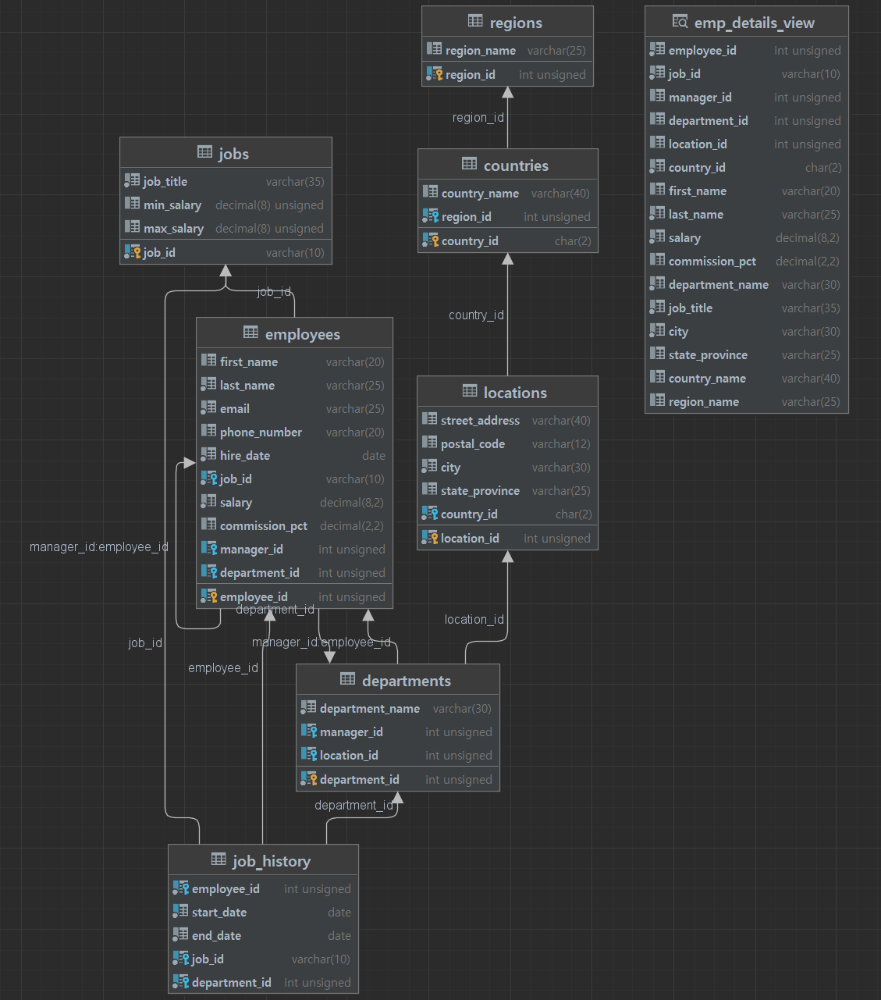

# 에코앤리치_코딩과제

# 목적
- 객체지향적으로 접근하여 유지보수할때 클린 코드구현을 통해 가독성을 높이는 목적
- 단위테스트를 통한 검증가능한 코드

---
# 사용기술
- JAVA17, Spring Boot 3.0.5, MyBatis, MySQL

---
# 프로그램 주요 기능
- 특정 사원의 현재 정보 조회 가능한 API 구현
- 특정 사원의 이력 정보 조회 가능한 API 구현
- 부서 및 위치 정보 조회 가능한 API 구현
- 특정 부서의 급여를 특정 비율로 인상 및 사원 정보 업데이트 할 수 있는 API 구현
- RDBMS 스키마와 별개로 공공 데이터 포털( www.data.go.r ) 등에서 임의의 API 선택 후    조회 가능하도록 커스터마이징된 API 구현

---
# ERD(Entity Relationship Diagram)

